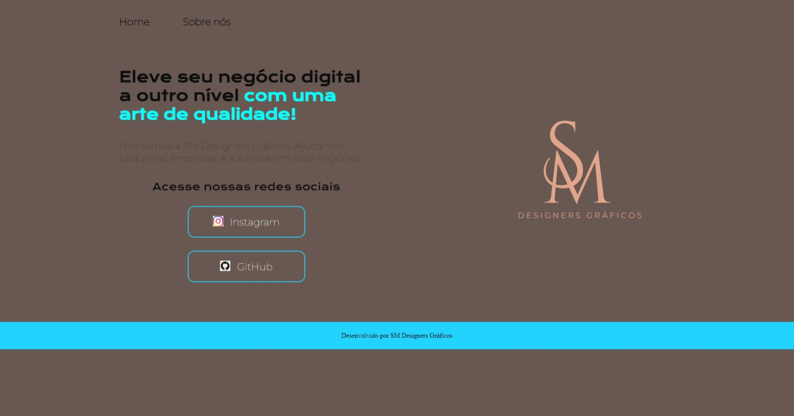

# SM Designers Gráficos

Projeto construído com objetivo de por em prática os conteúdos vistos no curso de HTML e CSS na Alura.

Página web, com navegação de links e responsividade. Adaptável para telas mobiles e desktop.

## 🧑‍💻 Tecnologias

- HTML
- CSS
- Git e GitHub

## 📩 Contato

* mateus_stangherlins@hotmail.com
* +55 (46) 9 9123-5798

[Clique aqui para acessar o site](https://mateus402.github.io/SM-Designers-Graficos/)
